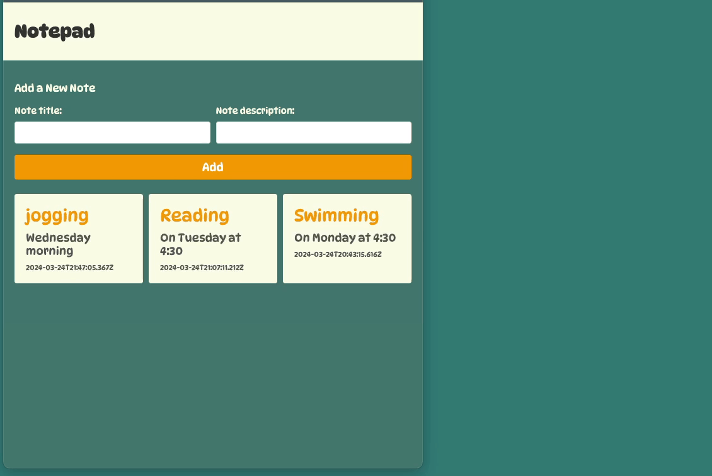

# MERNNote
- combining the technologies used - MongoDB, Express, React, Node.js

This project comprises a full-stack application for note management. 

**Backend:**
- Utilizes Node.js and Express.js to create a RESTful API for handling CRUD operations on notes.
- Establishes a connection to a MongoDB database using Mongoose.
- Defines routes for creating, retrieving, updating, and deleting notes.
- Implements controller functions to interact with the database and handle incoming requests.

**Frontend:**
- Developed using React.js to provide a user-friendly interface for interacting with notes.
- Utilizes React Router for client-side routing.
- Allows users to add new notes through a form and view existing notes with their details.
- Utilizes CSS for styling to create an appealing layout and design.

**Overall:**
- Users can seamlessly manage their notes through a visually pleasing and responsive web interface.
- The backend ensures efficient data management and communication with the frontend, enabling smooth user interactions.
- The frontend provides a dynamic and intuitive user experience, allowing users to focus on organizing their notes effectively.

**Screen view:**

